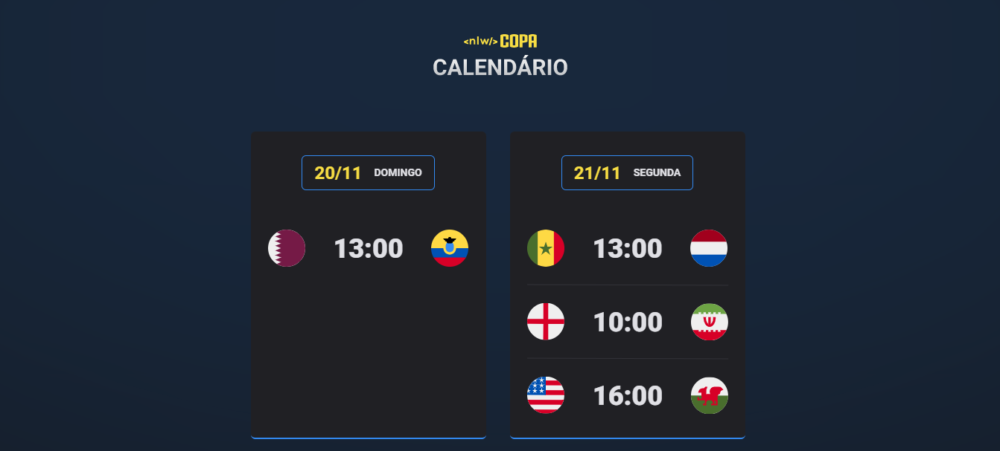

Copa NLW #10

Evento exclusivo e gratuito, promovido pela Rocketseat para ensino de tecnologias WEB.

<a>Tecnologias</a>   |   <a>Projeto</a>    |   <a>Esquema</a>   

 

 

calendário da copa

🚀Tecnologias

Esse projeto foi desenvolvido com as seguintes tecnologias:

HTML e CSS

SASS

JavaScript

Git e Github

💻Projeto

O Calendário da Copa é um projeto que mostra os jogos da Copa de 2022.

### 📝Descrição

Mais um projeto pra conta, como estamos no ano da copa nada mais do que um calendário com os jogos da copa 2022, fiz um calendário com os jogos da primeira rodada, projeto que gostei muito de fazer, pude usar o javascript para deixar o projeto mais dinâmico e uma tecnológia que ainda tenho dificulades mais que pude me desenvolver muito, apliquei o sass no projeto pra deixar o css mais organizado, projeto ficou muito top.🤟  

### 🔖Esquema

Você pode visualizar o layout do projeto através do <a hf="https://www.figma.com/file/eNCcZQYge4wVJPKdgM15HJ/Calend%C3%A1rio-de-Jogos-(Community)?node-id=0%3A1">DESSE LINK</a>. É necessário ter conta no Figma para acessá-lo.

### 💟  Contatos

gfillipe@gmail.com

https://www.linkedin.com/in/gabriel-fellipe/

# Let´s Code 🚀 
